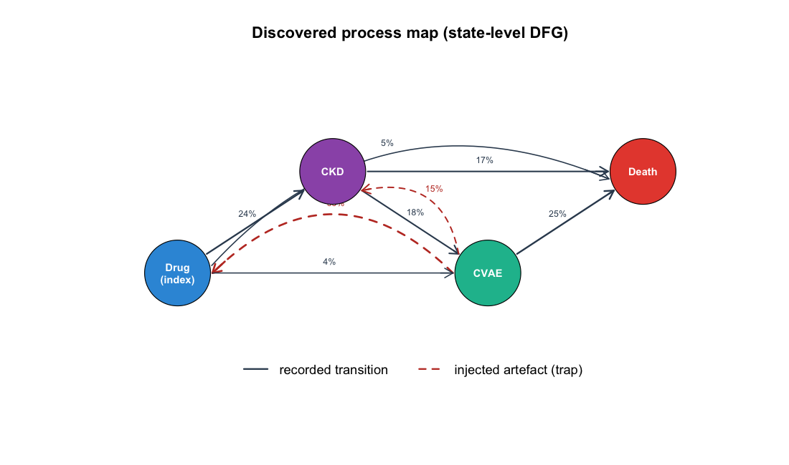
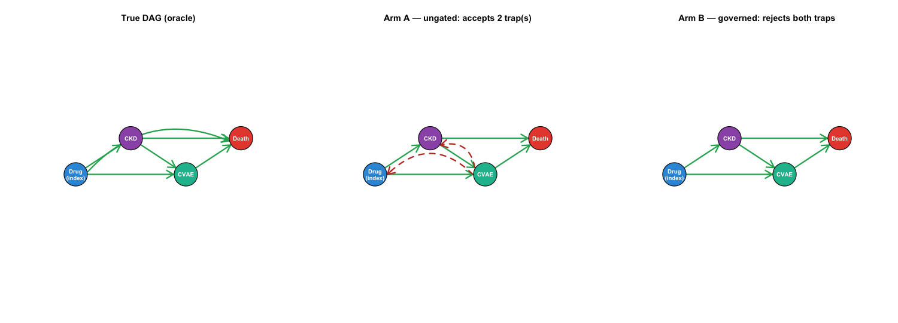

```{r setup, include=FALSE}
knitr::opts_chunk$set(echo = TRUE, message = FALSE, fig.width = 8, fig.height = 4.5)
source("closed_loop_sim.R")
```

This R tutorial mirrors the Python one. It validates the framework under a **known
truth**: a multi-state disease simulator generates data with **injected observation
artefacts**, and a governed loop must recover the true causal DAG while **rejecting the
artefacts** an ungoverned configuration accepts. Depends only on base R + `survival`.

States: **S0** index/on-drug → **S1** CKD → **S2** CVAE → **S3** Death. Trap edges
(recorded but not causal): `S2→S0` (drug-feedback decoy), `S2→S1` (reverse coding shift).

## 1. The latent truth (DGP)

```{r}
cfg <- base_cell()
pop <- simulate_population(2000, cfg, seed = 1)
mean(pop$E)                                   # ~0.69 PPI prevalence
pop$histories[[1]]                            # one patient's latent trajectory
c(S0_S1 = true_beta_E(cfg, "S0->S1"),
  S1_S2 = true_beta_E(cfg, "S1->S2"))         # 0.25 and 0 (mediation via occurrence)
```

## 2. The oracle

```{r}
TRUE_KEYS                                     # the 6 true transitions
TRAP_KEYS                                     # the two traps to reject
med <- mediated_proportion(cfg, n = 8000, seed = 4, horizon = cfg$t_max)
round(med$mediated_proportion, 2)             # ~0.45 (use large n for a stable oracle)
```

## 3. The observation process and the artefacts

```{r}
data <- build_event_log(6000, cfg, seed = 1)
head(data$log, 8)
c(decoy = "MedicationChange" %in% data$log$activity,
  coding_shift = "CKD_recode" %in% data$log$activity)
# surveillance bias: PPI CKD recorded earlier than H2B
ckd <- data$log[data$log$activity == "CKD_recorded", ]
c(PPI = median(ckd$time[ckd$group == "PPI"]),
  H2B = median(ckd$time[ckd$group == "H2B"]))
```

## 4. Discovery: the process map

```{r}
disc <- discover(data$log, data$visit_counts)
for (k in names(disc)) cat(sprintf("%-8s risk=%.2f  src=%s\n", k, disc[[k]]$risk,
                                    paste(disc[[k]]$src, collapse = "/")))
process_map(disc, file = "../results_R/process_map.png")

```

## 5. Refinement: the three arms

```{r}
for (a in c("A", "B", "C")) {
  res <- run_arm(a, disc)
  cat(a, "traps accepted:", paste(intersect(res$edges, TRAP_KEYS), collapse = ", "),
      "| Death node:", "S3" %in% res$nodes, "\n")
}
dag_refinement(list(A = run_arm("A", disc)$edges, B = run_arm("B", disc)$edges),
               file = "../results_R/dag_refinement.png")

```

## 6. Structural recovery metrics

```{r}
for (a in c("A", "B", "C")) {
  m <- structural_metrics(run_arm(a, disc))
  cat(sprintf("Arm %s: precision=%.2f recall=%.2f SHD=%d traps=%d\n",
              a, m$precision, m$recall, m$shd, m$n_traps))
}
```

Arm B's recall is 0.83 (not 1.0): the rare `S0→S3` background-mortality edge (~5%) is below
the 10% process-mining threshold — an honest sample-size limitation. The Death node is still
recovered via the high-mortality `S1→S3` and `S2→S3` transitions.

## 7. Estimand recovery: the surveillance-bias story

```{r}
e <- estimate(data, cfg$t_max)
sapply(c("s0s1_latent", "s0s1_naive", "s0s1_adjusted"), function(k) round(e[[k]]$beta, 3))
# latent ~0.25 (truth)   naive ~0.34 (surveillance-inflated)   adjusted ~0.7 (over-corrects)
```

The cause-specific Cox recovers the truth on the latent process; surveillance bias inflates
the recorded estimate; a naive visit-count adjustment **over-corrects** (collider bias),
which is why the framework treats surveillance bias as a structural diagnostic, not a
covariate adjustment.

## 8. The full study

```{r}
res <- run_cell(cfg, M = 30, with_estimation = TRUE)
c(A = res$structural$A$accept_any_trap_rate,   # 1.0  ungated accepts a trap
  B = res$structural$B$accept_any_trap_rate)    # 0.0  governed rejects both
res$estimation$s0s1_latent$coverage             # ~0.95 near-nominal
```

From the command line, `Rscript run_study.R 100` runs the study and writes
`../results_R/` (summary.txt, replications.csv, figures).

## Summary

The governed loop (Arm B) recovers the true structure including the Death competing-risk
node and rejects both injected artefacts (0% acceptance), while the ungoverned configuration
(Arm A) accepts them (100%). The selected model recovers the true cause-specific hazard ratio
at near-nominal coverage on the underlying process. See `../docs/METHODS_SPEC.md` for the full
specification and `../docs/manuscript_sections.md` for the manuscript text.
