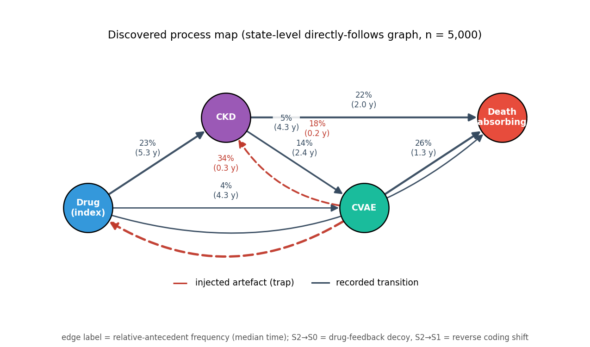
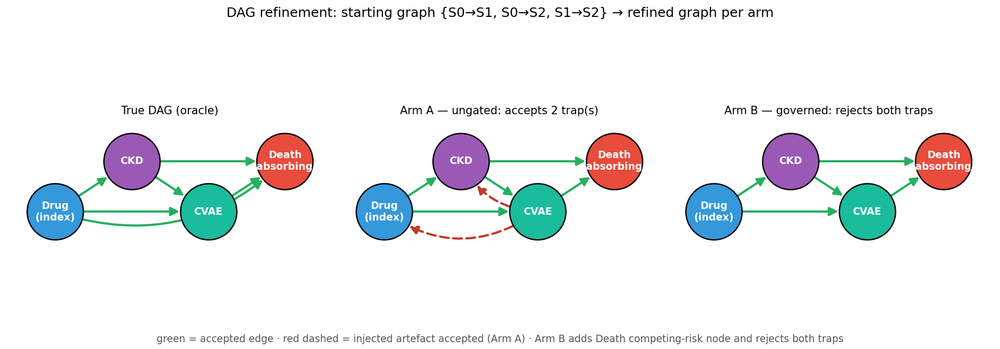
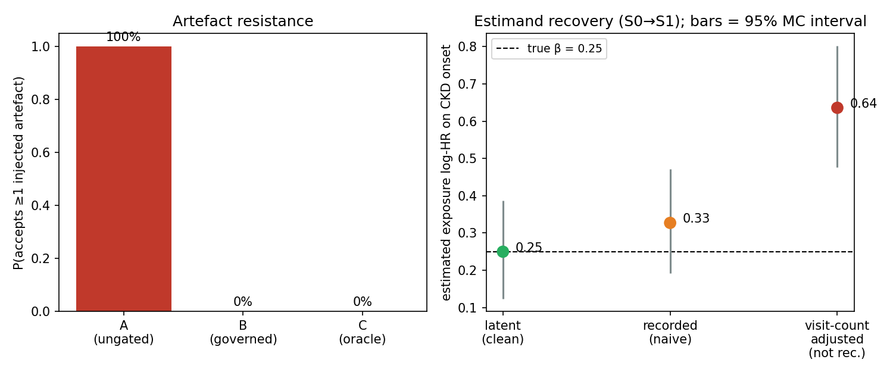

# Closed-Loop Causal Refinement — Ground-Truth Simulation (Manuscript Companion)

Reproducible companion code for the simulation study in *"A Closed-Loop Framework for
Knowledge-Based Causal Model Refinement Using Process Mining and Human–AI Governance."*

This repository validates the framework under a **known data-generating process**: a
fully specified continuous-time multi-state disease simulator generates data with
**deliberately injected observation artefacts**, and the governed loop must recover the
true causal DAG while **rejecting the artefacts** that an ungoverned configuration accepts.
Because we own the simulator, every ground-truth quantity (true edges, true hazard ratios,
true mediated proportion) is known and the framework is graded against it.

> **Open in Colab:** upload `notebooks/closed_loop_simulation.ipynb` to
> [Google Colab](https://colab.research.google.com/), or after pushing this repo to GitHub
> use the badge link
> `https://colab.research.google.com/github/<your-org>/closed-loop-simulation-companion/blob/main/notebooks/closed_loop_simulation.ipynb`.

---

## What the study shows

Three claims, each graded against the simulator oracle:

1. **Structural recovery** — the governed loop recovers the true graph (including adding the
   Death competing-risk node) from the observed process map.
2. **Artefact resistance** — the plausibility gate rejects two observation-induced edges
   (a drug-feedback *decoy* and a reverse *coding shift*) that an ungoverned arm accepts.
3. **Estimand recovery** — the model the framework selects recovers the true cause-specific
   hazard ratio at near-nominal coverage.

### Headline result (base cell: n = 5,000, M = 500 replications)

| Arm | Proposer + gate | Precision | Recall | Accepts ≥1 artefact | Death node |
|-----|-----------------|-----------|--------|---------------------|-----------|
| **A** ungated | mechanical + auto-accept | 0.71 | 0.83 | **100%** | ✓ |
| **B** governed | mechanical + plausibility gate | **1.00** | 0.83 | **0%** | ✓ |
| **C** oracle | true DAG given | 1.00 | 1.00 | 0% | ✓ |

Estimand recovery (true exposure log-HR on CKD onset = 0.25): the cause-specific Cox model
recovers **β̂ = 0.250 at 96% coverage** on the latent process; surveillance bias inflates the
recorded estimate to 0.33; a naive visit-count adjustment over-corrects (collider bias),
illustrating that surveillance bias is structural, not fixable by covariate adjustment.

### Figures

| Process map (observed DFG) | DAG refinement (True / A / B) |
|---|---|
|  |  |



---

## The two-layer design

The validity of the study rests on one separation: the **latent disease process** (the
truth) is kept strictly apart from the **observation process** (what gets recorded), and the
observation layer is where the biases are manufactured.

```
 Latent disease process (dgp.py, truth.py)  ── true causal DAG (the truth)
            │
            ▼
 Observation process (observation.py)        ── visits, detection delays, INJECTED artefacts
            │                                    (decoy S2→S0, coding shift S2→S1)
            ▼
 event log → discovery (pm4py DFG) → refinement (Arm A | B | C) → estimation → metrics
                                              │
                                       graded vs truth.py
```

States: **S0** index/on-drug → **S1** CKD → **S2** CVAE → **S3** Death (absorbing). The two
trap edges (`S2→S0` drug-feedback decoy, `S2→S1` reverse coding shift) appear in the recorded
log but have **no latent causal intensity** — the governed gate must reject them.

---

## Install

Requires Python ≥ 3.10.

```bash
pip install -e ".[dev]"        # installs numpy, scipy, pandas, pydantic, pm4py, lifelines
pytest closed_loop_sim/tests -q
```

Or, without editable install:

```bash
pip install -r requirements.txt
```

## Quickstart

```bash
# Run the full base-cell study (M replications) -> results/
python -m closed_loop_sim.run_study 500

# Fill the manuscript Methods/Results template + render the summary figure
python -m closed_loop_sim.finalize

# Regenerate the process map + DAG-refinement figures
python -m closed_loop_sim.visualize
```

A smaller, faster run for a first look:

```python
from closed_loop_sim.config import base_cell
from closed_loop_sim.experiment import run_cell

res = run_cell(base_cell(), M=20, with_estimation=True)
print(res["structural"]["A"]["accept_any_trap_rate"],  # 1.0  (ungated accepts a trap)
      res["structural"]["B"]["accept_any_trap_rate"])   # 0.0  (governed rejects both)
```

See **[docs/TUTORIAL.md](docs/TUTORIAL.md)** for a step-by-step walkthrough, and the
**[Colab notebook](notebooks/closed_loop_simulation.ipynb)** to run it interactively.

---

## Repository layout

```
closed_loop_sim/
  config.py        parameter models + base-cell defaults (pydantic)
  dgp.py           latent truth: Weibull-PH hazards, trajectory sampler, population
  truth.py         oracle: true DAG, true beta_E, g-computation mediated proportion
  observation.py   visit process, detection delays, artefact injection
  eventlog.py      assemble the patient-level activity event log
  discovery.py     directly-follows graph (pm4py) + monitoring-stratified evidence
  refinement.py    Proposer / Gate interfaces; arms A (ungated) / B (governed) / C (oracle)
  estimation.py    cause-specific Cox (lifelines): latent / recorded / adjusted
  metrics.py       structural metrics graded vs the oracle
  experiment.py    run replications of a cell and aggregate
  calibration.py   observed-log Table-4 calibration + latent plausibility
  run_study.py     entry point: run the base cell and write results/
  finalize.py      fill manuscript sections + render summary figure
  visualize.py     process map + DAG-refinement figures
  tests/           unit + integration tests (24 tests)
docs/
  TUTORIAL.md            step-by-step tutorial
  METHODS_SPEC.md        full simulation specification (the authoritative plan)
  manuscript_sections.md the new Methods + Results text (with filled numbers)
notebooks/
  closed_loop_simulation.ipynb   Google Colab tutorial notebook
results/
  process_map.png, dag_refinement.png, figure_simulation.png
  base_cell_results.json, replications.csv   (M = 500 archived results)
```

## Reproducibility

One master seed (`SeedSequence`) yields deterministic per-replication seeds; the DGP and
observation processes use **separate** spawned streams, so the latent truth is invariant to
changes in the observation model. The recorded event log is calibrated to the published
Table 4 transition-risk pattern (worst absolute discrepancy 0.055 under tolerance 0.08).
Software versions are recorded in `results/base_cell_results.json`.

## Roadmap

The deterministic study here is **Part A** (current manuscript). A designed extension swaps
the mechanical proposer/gate for **real LLMs** (Claude/Gemini via OpenRouter, or local models
via Ollama) and adds Autonomous-AI vs Governed-AI modes, multi-model benchmarking, and a RAG
ablation — deferred to a follow-up manuscript. The two are slices of one two-axis model
(proposer × gate), so the LLM layer is an additive drop-in.

## Citation

If you use this code, please cite the manuscript (details to be added on publication).

## License

MIT — see [LICENSE](LICENSE).
